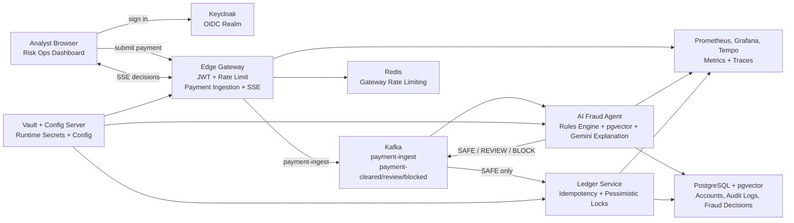

# Agentic Payment Integrity & Fraud Engine

* **Live Demo URL:** add deployment link when the local stack is exposed for review.
* **Demo Video Link:** add walkthrough link when recorded.
* **Primary UI:** `http://localhost:3001` after the Docker Compose stack is running.

> **Operational Note for Reviewers:** This project is designed to run as a full local fintech stack. The dashboard, Gateway, Kafka, Keycloak, Vault, PostgreSQL, Redis, Config Server, AI fraud agent, ledger service, Prometheus, Grafana, and Tempo all come up through Docker Compose. Gemini can be enabled for production-style explanation generation, but the fraud decision itself remains deterministic and auditable.

Agentic Payment Integrity & Fraud Engine is a **production-style payment risk and ledger integrity platform**. It accepts payment events, routes them through a hybrid fraud engine, streams decisions to an analyst dashboard, and posts only cleared payments into an audited ledger.

## What It Does

This project simulates the payment integrity layer a fintech team would put between customer payment initiation and ledger posting. The Gateway validates and publishes payment events to Kafka. The AI fraud agent consumes those events, applies deterministic Java risk scoring, optionally asks Gemini for a bounded analyst explanation, and routes the payment to `SAFE`, `REVIEW`, or `BLOCK`. The ledger service consumes only cleared payments and writes them with pessimistic locking, idempotency claims, and immutable audit triggers.

The dashboard gives reviewers a live command center: submit demo payment payloads, watch Gateway SSE decisions arrive, inspect the model-style reasoning, and see how risky transactions are stopped before ledger mutation.

## Why I Built This

I built this to show the harder part of AI in financial systems: not just calling an LLM, but wrapping it with deterministic controls, event contracts, secure service boundaries, and evidence that can survive an audit. Payment fraud systems need fast routing, but they also need reproducibility, idempotency, secret handling, and a clean answer to “why did this transaction move or stop?”

The design keeps the LLM in the right place. Gemini can explain a decision to an analyst, but it cannot approve a payment or override the rules engine. That separation is the core idea of the project.

## Demo Flow

Expected behavior from a short local demo session:

```text
1. Sign in to the dashboard through the imported Keycloak realm.
2. Open the Demo Simulator and load the safe India-market payment.
3. Submit the UPI payload from acct-mumbai-salary-104392 to acct-kirana-settlement-2048.
4. Watch the SAFE event stream into the dashboard and proceed toward the ledger.
5. Load the review template for a Jaipur marketplace seller and submit it.
6. Watch the REVIEW event stream in with step-up/manual-review reasoning.
7. Load the block template for a mule-wallet payout and submit it.
8. Watch the BLOCK event stream in; the ledger service does not post it.
```

The included demo data uses Indian-style account identifiers, local merchant scenarios, UPI/card/bank-transfer payment methods, and INR amounts so the walkthrough feels like a real payment integrity demo rather than generic generated sample data.

## Architecture



## Services Used

| Component | Technology | Role |
|---|---|---|
| Risk dashboard | Next.js, NextAuth, Tailwind, Recharts | Analyst UI, demo payload submission, live event ledger, fraud reasoning modal. |
| Edge Gateway | Spring Cloud Gateway, WebFlux, Reactor Kafka | Authenticated payment ingestion, Redis rate limiting, Kafka publishing, SSE bridge. |
| AI fraud agent | Spring Boot, Spring AI, Gemini, pgvector | Deterministic risk scoring, optional explanation generation, decision publication. |
| Ledger service | Spring Boot, JPA, PostgreSQL | Posts cleared payments with idempotency, row locks, and audit context. |
| Config server | Spring Cloud Config, Vault | Centralized runtime configuration and secret-backed placeholders. |
| Identity | Keycloak | Local OIDC realm for dashboard and Gateway JWT flow. |
| Messaging | Kafka | Event backbone for payment ingest and decision routing. |
| Storage | PostgreSQL with pgvector | Ledger tables, fraud decision evidence, vector profiles, immutable audit logs. |
| Observability | Prometheus, Grafana, Tempo | Local metrics and trace-ready runtime stack. |

## What I Did For Integrity

- **Deterministic decision first:** `RiskScoringEngine` produces the final `SAFE`, `REVIEW`, or `BLOCK` result before any model explanation is requested.
- **LLM as analyst assist only:** Gemini receives bounded context and returns reasoning only; it does not decide ledger routing.
- **Kafka contract validation:** consumers validate schema version, event type, correlation IDs, payload constraints, and record keys.
- **Idempotent ledger posting:** payment claims prevent repeated terminal processing of the same payment.
- **Serialized account mutation:** ledger account rows are locked in deterministic order to avoid double debit and concurrent write drift.
- **Immutable audit trail:** database triggers record balance changes and reject audit-row updates or deletes.
- **Secret isolation:** local runtime secrets flow through Vault and Config Server rather than Java source.
- **Log hygiene:** Logback masking reduces exposure of account IDs, card-like values, emails, and exception spillover.

## How To Run It

### Prerequisites

- Docker and Docker Compose
- JDK 21
- Node.js 20+
- A Gemini API key if you want production-style model explanations

### Configure Secrets

```bash
cp .env.example .env
```

Edit `.env` and fill the required values. For a local mock-AI run, keep the AI agent on the mock profile. For Gemini-backed explanations, follow `PRODUCTION_LOCAL_RUNBOOK.md`.

### Start The Stack

```bash
docker compose up -d --build
```

Open the dashboard:

```text
http://localhost:3001
```

### Useful Runtime Checks

```bash
docker compose ps
curl http://localhost:8080/actuator/health
curl http://localhost:8082/actuator/health
curl http://localhost:8083/actuator/health
```

### Developer Checks

```bash
cd edge-gateway && mvn --batch-mode --no-transfer-progress test
cd ../ai-fraud-agent && mvn --batch-mode --no-transfer-progress test
cd ../ledger-service && mvn --batch-mode --no-transfer-progress test
cd ../risk-ops-dashboard && npm run lint && npm run build
cd .. && docker compose config --quiet
```

## Production-Style Local Mode

Use `PRODUCTION_LOCAL_RUNBOOK.md` when you want the real Gemini provider enabled locally. That mode keeps deterministic Java rules as the source of truth while letting Gemini write short analyst-facing explanations from the fixed risk evidence packet.

## Documentation Map

- `docs/THREAT_MODEL.md` explains the STRIDE-style threat model and residual production requirements.
- `docs/COMPLIANCE_ALIGNMENT.md` maps the implementation to PCI DSS, SOC 2, GDPR, and India's DPDP Act expectations.
- `docs/MODEL_GOVERNANCE.md` explains why the LLM is not the decision authority.
- `docs/HIGH_AVAILABILITY_DR.md` outlines a realistic AWS production topology and failover approach.
- `PRODUCTION_LOCAL_RUNBOOK.md` shows how to run the local stack with real Gemini explanations.

## What I Used AI For

I used AI assistance for implementation acceleration and review: service scaffolding, UI shaping, README polishing, risk-scenario wording, test ideas, and debugging support from logs. The important system choices are explicit in the code: deterministic risk authority, Kafka event boundaries, ledger idempotency, audit immutability, Vault-backed configuration, and the dashboard's live analyst workflow.

## What I Would Change With 4 More Weeks

- Extract a shared payment contract module once the service APIs stabilize.
- Add tenant-aware risk policy configuration and per-merchant thresholds.
- Add a controlled analyst override workflow with reason codes and immutable approvals.
- Export audit rows to object storage with retention lock.
- Add end-to-end tests that submit Gateway payments and verify Kafka, fraud decisions, and ledger outcomes.
- Add dashboards for Kafka lag, rule-trigger distribution, model explanation failures, and ledger posting latency.
- Replace local Vault dev mode with workload identity and short-lived credentials in a managed environment.
